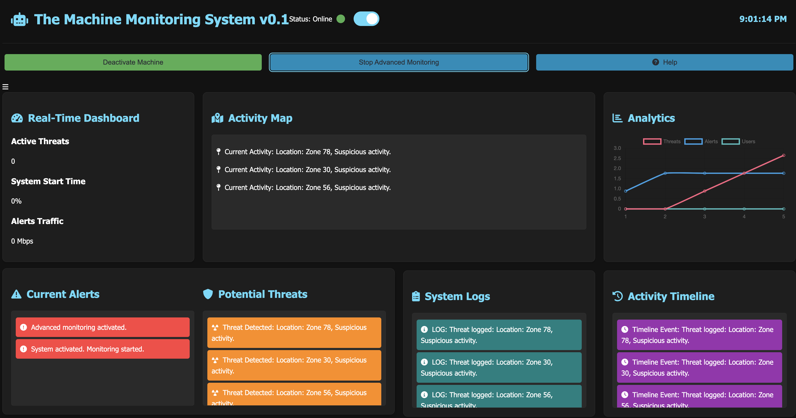
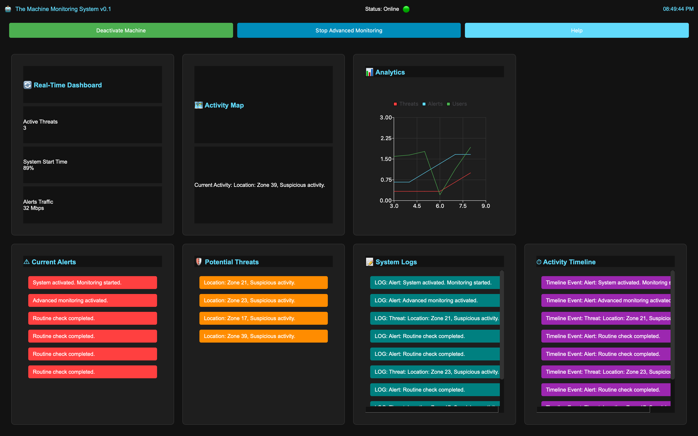

# The Machine Interface

  

A modern surveillance system interface inspired by the TV show "Person of Interest". This project implements both a web-based interface and a PyQt5 desktop application for monitoring and analyzing potential security threats.

## 🌟 Features

### Web Interface

- Real-time monitoring dashboard
- Advanced threat detection system
- Interactive analytics and data visualization
- Activity mapping and timeline tracking
- Customizable alerts and notifications
- Accessibility features and multiple themes
- Responsive design for all devices

### Desktop Application

- PyQt5-based native interface
- Real-time system monitoring
- Advanced analytics with interactive charts
- Threat detection and alert system
- System logs and activity timeline
- Performance metrics visualization

## 🚀 Getting Started

### Prerequisites
- Python 3.8+
- Node.js (for web interface)
- Modern web browser

